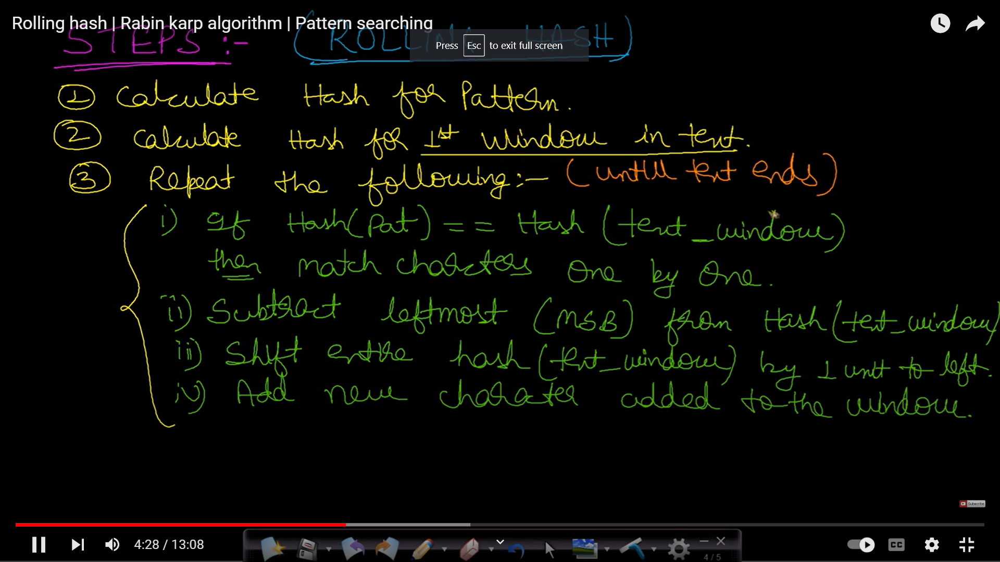

# concepts

### Rolling Hash 


# code
```
/* Following program is a C++ implementation of Rabin Karp 
Algorithm given in the CLRS book */
#include <bits/stdc++.h> 
using namespace std; 

// d is the number of characters in the input alphabet 
#define d 256 

/* pat -> pattern 
	txt -> text 
	q -> A prime number 
*/
void search(char pat[], char txt[], int q) 
{ 
	int M = strlen(pat); 
	int N = strlen(txt); 
	int i, j; 
	int p = 0; // hash value for pattern 
	int t = 0; // hash value for txt 
	int h = 1; 

	// The value of h would be "pow(d, M-1)%q" 
	for (i = 0; i < M - 1; i++) 
		h = (h * d) % q; 

	// Calculate the hash value of pattern and first 
	// window of text 
	for (i = 0; i < M; i++) 
	{ 
		p = (d * p + pat[i]) % q; 
		t = (d * t + txt[i]) % q; 
	} 

	// Slide the pattern over text one by one 
	for (i = 0; i <= N - M; i++) 
	{ 

		// Check the hash values of current window of text 
		// and pattern. If the hash values match then only 
		// check for characters on by one 
		if ( p == t ) 
		{ 
			/* Check for characters one by one */
			for (j = 0; j < M; j++) 
			{ 
				if (txt[i+j] != pat[j]) 
					break; 
			} 

			// if p == t and pat[0...M-1] = txt[i, i+1, ...i+M-1] 
			if (j == M) 
				cout<<"Pattern found at index "<< i<<endl; 
		} 

		// Calculate hash value for next window of text: Remove 
		// leading digit, add trailing digit 
		if ( i < N-M ) 
		{ 
			t = (d*(t - txt[i]*h) + txt[i+M])%q; 

			// We might get negative value of t, converting it 
			// to positive 
			if (t < 0) 
			t = (t + q); 
		} 
	} 
} 

/* Driver code */
int main() 
{ 
	char txt[] = "GEEKS FOR GEEKS"; 
	char pat[] = "GEEK"; 
	int q = 101; // A prime number 
	search(pat, txt, q); 
	return 0; 
} 
```